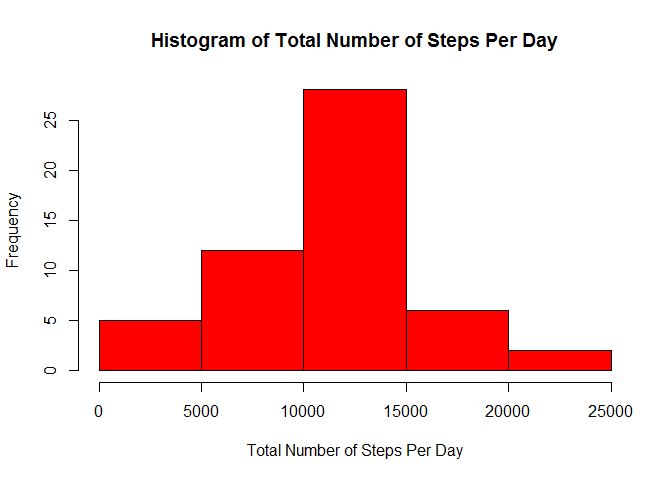
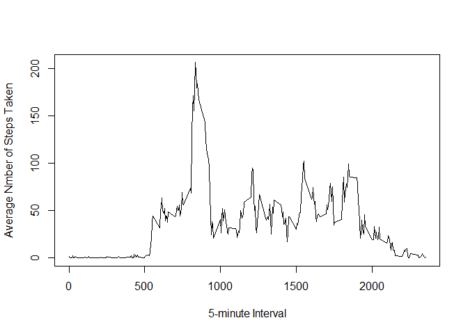
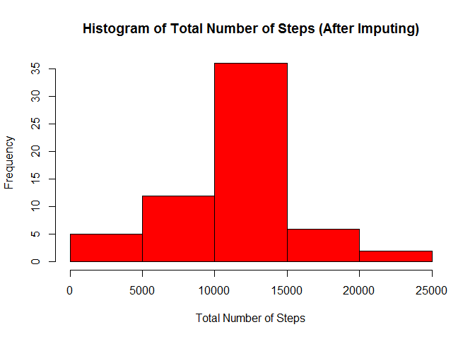
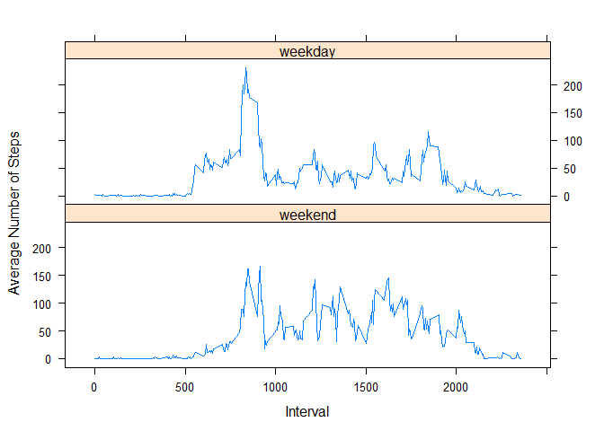

# Reproducible Research: Peer Assessment 1


## Loading and preprocessing the data
In this part, I am going to load the data, but I won't process or transform the data until the final part. The data is loaded into a data frame called "data".

```r
unzip("activity.zip")  ## Unzip the file
data <- read.csv("activity.csv", stringsAsFactors = FALSE)  ## Load the data
## Date transformation will be implemented in the final part about the activity differences between weekdays and weekends.
head(data)
```

```
##   steps       date interval
## 1    NA 2012-10-01        0
## 2    NA 2012-10-01        5
## 3    NA 2012-10-01       10
## 4    NA 2012-10-01       15
## 5    NA 2012-10-01       20
## 6    NA 2012-10-01       25
```


## What is mean total number of steps taken per day?
First, let's calculate the total number of steps taken each day.

```r
## Calculate the total number of steps taken per day
sum_steps <- aggregate(steps ~ date, data=data, FUN = sum, na.action = na.omit)
head(sum_steps)
```

```
##         date steps
## 1 2012-10-02   126
## 2 2012-10-03 11352
## 3 2012-10-04 12116
## 4 2012-10-05 13294
## 5 2012-10-06 15420
## 6 2012-10-07 11015
```
The following is its histogram.

```r
## Make a histogram of it
hist(sum_steps$steps, col="red", main = "Histogram of Total Number of Steps Per Day", xlab = "Total Number of Steps Per Day")
```

 
  
Then let's calculate its mean and median.

```r
## Calculate the mean of the total number of steps
mean_steps <- mean(sum_steps$steps)  
mean_steps  ## Print the mean
```

```
## [1] 10766.19
```

```r
## Calculate the median of the total number of steps
median_steps <- median(sum_steps$steps)  
median_steps  ## Print the median
```

```
## [1] 10765
```


## What is the average daily activity pattern?
In this part, we first calculate the average number of steps taken in each 5-minute interval, averaged across all days.

```r
## Calculate the average number of steps taken per interval
avg_steps <- aggregate(steps ~ interval, data=data, FUN = mean, na.action = na.omit)
head(avg_steps)
```

```
##   interval     steps
## 1        0 1.7169811
## 2        5 0.3396226
## 3       10 0.1320755
## 4       15 0.1509434
## 5       20 0.0754717
## 6       25 2.0943396
```
The following is the time series plot of the interval (x-axis) and the average number of steps taken in that interval (y-axis).

```r
## Make a time series plot
plot(avg_steps$interval, avg_steps$steps, type = 'l', xlab = "5-minute Interval", ylab = "Average Nmber of Steps Taken")
```

 
  
Which interval contains the maximum average number of steps? Let's find it out.

```r
## Find the 5-minute interval that has the maximum average number of steps
max_idx <- which.max(avg_steps$steps)  ## Find the index of the maximum
intvl <- avg_steps$interval[max_idx]  ## Find the corresponding interval
intvl  ## Print it
```

```
## [1] 835
```
Therefore, the interval 835 has the maximum.


## Imputing missing values
Let's first find out the total number of missing values in the data set (i.e., the total number of rows with NAs).

```r
## Get the total number of missing values 
num_na <- sum(!complete.cases(data))
num_na
```

```
## [1] 2304
```
Below we are going to impute the missing values with the average number of steps for the corresponding 5-minute interval. We first copy the data into a new data frame, then for each row we examine if there is a missing value. If so, then we impute it using the average number of steps for its interval.

```r
## Impute missing values with the mean for that 5-minute interval
data_new <- data  ## Copy the data
for (i in 1:nrow(data_new)) {
    if (is.na(data_new[i, "steps"])) {
        data_new[i, "steps"] <- avg_steps[avg_steps$interval == data_new[i, "interval"], "steps"]  
    }
}
head(data_new)
```

```
##       steps       date interval
## 1 1.7169811 2012-10-01        0
## 2 0.3396226 2012-10-01        5
## 3 0.1320755 2012-10-01       10
## 4 0.1509434 2012-10-01       15
## 5 0.0754717 2012-10-01       20
## 6 2.0943396 2012-10-01       25
```

```r
sum(!complete.cases(data_new))  ## Check if there are missing values
```

```
## [1] 0
```
In the following, we recalculate the total number of steps taken each day using the new dataset.

```r
## Calculate the total number of steps taken per day using the new data
sum_steps_new <- aggregate(steps ~ date, data=data_new, FUN = sum)
head(sum_steps_new)
```

```
##         date    steps
## 1 2012-10-01 10766.19
## 2 2012-10-02   126.00
## 3 2012-10-03 11352.00
## 4 2012-10-04 12116.00
## 5 2012-10-05 13294.00
## 6 2012-10-06 15420.00
```
Then we plot a histogram of the new data.

```r
## Make a histogram of the new data
hist(sum_steps_new$steps, col="red", main = "Histogram of Total Number of Steps (After Imputing)", xlab = "Total Number of Steps")
```

 
  
The mean and median of the total number of steps taken per day are recalculated.

```r
## Calculate the mean of the total number of steps using the new data
mean_steps_new <- mean(sum_steps_new$steps)  
mean_steps_new
```

```
## [1] 10766.19
```

```r
## Calculate the median of the total number of steps using the new data
median_steps_new <- median(sum_steps_new$steps) 
median_steps_new
```

```
## [1] 10766.19
```
By comparing the new mean and median with the above counterparts, we see that, the mean does not change after the imputing. This is because we impute missing values with the mean for the interval. However, the median changes.


## Are there differences in activity patterns between weekdays and weekends?
In this part, we are going to analyze the activity differences between weekdays and weekends. First, we transform "date" from the character format to the date format, and tell if the day is weekend or not, and create a new factor variable "daytype" into the dataset indicating whether the date is a weekday or weekend day.

```r
## Transform "date" into the Date format and store it to a new variable "date1"
date1 <- strptime(data_new$date, "%Y-%m-%d")
## Tell if a day is weekend or not
weekend <- weekdays(date1, abbreviate = T) %in% c("Sat", "Sun")
## Create a new factor variable indicating weekday or weekend
data_new$daytype <- factor(weekend, levels = c(TRUE, FALSE), labels = c("weekend", "weekday"))
```
Below we calculate the average number of steps taken in each interval per day type (weekday or weekend) using the new data set.

```r
## Calculate the average number of steps taken in each interval per day type using the new data
avg_steps_new <- aggregate(steps ~ interval + daytype, data=data_new, FUN = mean)
head(avg_steps_new)
```

```
##   interval daytype       steps
## 1        0 weekend 0.214622642
## 2        5 weekend 0.042452830
## 3       10 weekend 0.016509434
## 4       15 weekend 0.018867925
## 5       20 weekend 0.009433962
## 6       25 weekend 3.511792453
```
In the final step, we make a panel plot containing two time series plots of the 5-minute interval and the average number of steps taken (averaged across all weekday or weekend days), one for weekday and one for weekend.

```r
##install.packages("lattice")  ## Install the "lattice" package if necessary 
library(lattice)
```

```
## Warning: package 'lattice' was built under R version 3.2.2
```

```r
xyplot(steps ~ interval | daytype, data = avg_steps_new, layout = c(1, 2), xlab = "Interval", ylab = "Average Number of Steps", type = 'l')
```

 
